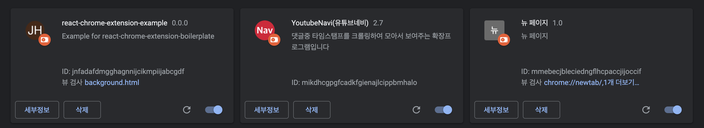
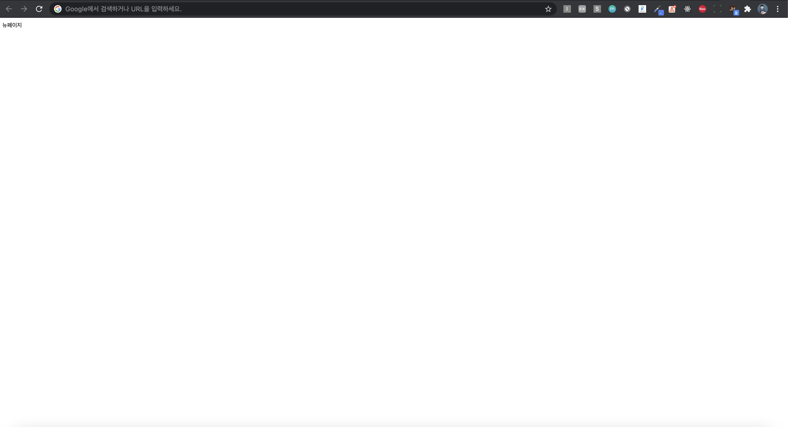

안녕하세요:)

여러분의 크롬 익스텐션의 부담감을 덜어드리기 위한 boilerplate 입니다.

우선 크롬 익스텐션의 경우 종류가 크게 3가지가 있는데

1. popup extension
2. inject extension
3. new tab extension

입니다.

오늘은 그중 new tab extionsion 초기환경 셋팅을 해보도록 하겠습니다.

파일을 하나씩 살펴보면

- manifest.json  
  크롬 익스텐션의 환경설정을 담당하는 부분, 권한 설정과, 특정 url에서 반응하게끔 하는 등.. 다양한 설정들을 할 수 있습니다.

- background.js  
  크롬 익스텐션이 돌아갈 때 뒤에서 계속해서 돌아가야 하는 js 파일입니다. 여기에 tab클릭 관련 listener를 적어줍니다.

- new.html  
  새로운 탭을 만들 때 보여줄 html 파일입니다. React로 개발하고 싶다면 build 시 해당 html 파일이 생성되게끔 하면 됩니다.

---

익스텐션을 적용하고 확인하는 방법에 대해 알아보겠습니다.

1. 우선 해당 파일들을 내려받은 후

> git clone ;;;
>  

2. [크롬 익스텐션 관리자 사이트](chrome://extensions/) 에 접속 합니다.

3. 좌측 상단에 있는 '압축 해제된 확장프로그램을 로드합니다'를 클릭 후 에 해당 파일들을 선택 후 확인을 눌러줍니다.

4. 다음과 같이 나온다면 적용 성공~!!!
   

5. 새 탭을 눌렀을 때 다음과 같이 나오게 됩니다.
   

---

크롬 익스텐션에 익숙하지 않으신분들은 기존 개발과 다른 설정에 약간 주춤할 수 있습니다.  
하지만 결국 html, css, js를 가지고 만드는 서비스이기 때문에 겁먹으실 필요가 없습니다.  
환경 설정보다 개발에 힘썼으면 좋겠다는 생각에 해당 포스트를 공유합니다. 앞으로 더 많은 정보들을 공유하도록 하겠습니다. 감사합니다~!!
